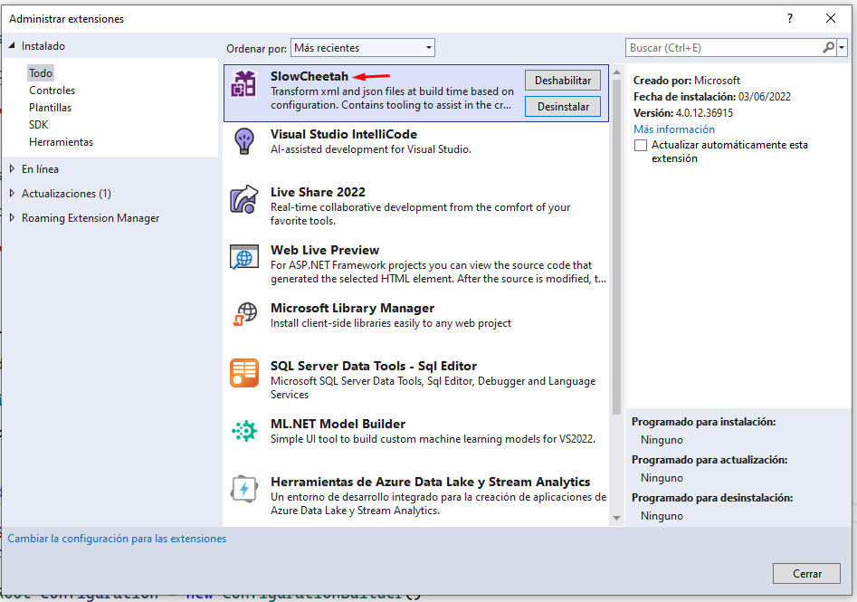
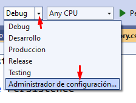
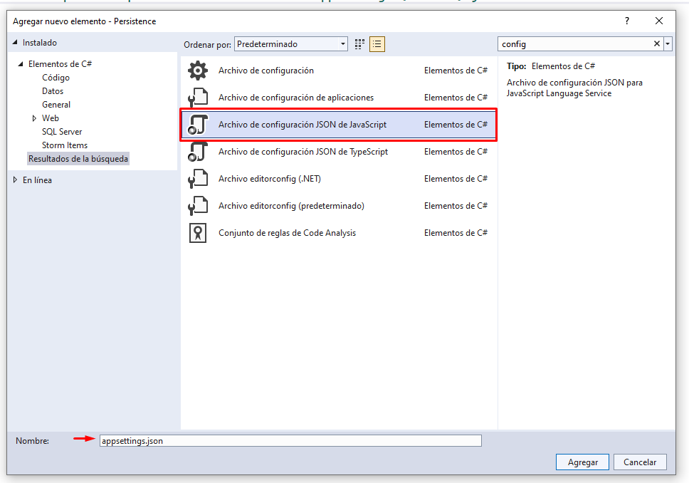
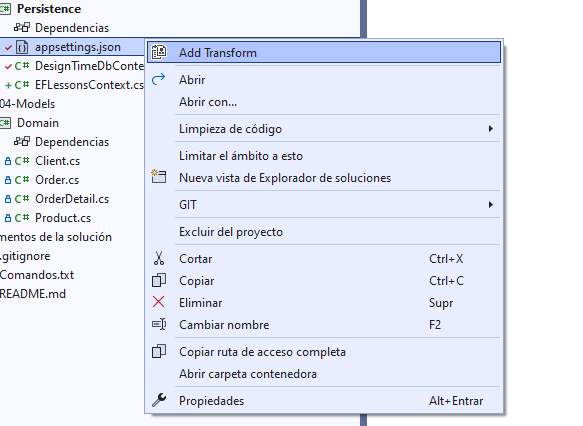
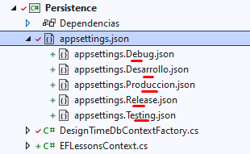
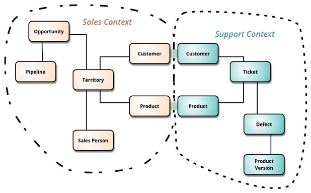

# Acerca de mi 
[Perfil](https://github.com/pabloMoron/profile)

## Acerca de este proyecto
Este es un proyecto personal, que forma parte de mi [portfolio](https://github.com/pabloMoron/profile#portfolio-personal).

Este proyecto es un ejemplo de Entity Framework Core con .NET 6.
# Paquetes instalados en este ejercicio
- Microsoft.EntityFrameworkCore
- Microsoft.EntityFrameworkCore.Design
- Microsoft.EntityFrameworkCore.SQLServer
- El paquete ~~Microsoft.EntityFrameworkCore.Tools~~ (No instalar), permite usar comandos por la consola del administrador de paquetes nuget. Pero hay una herramienta más nueva para hacer lo mismo pero con un potencial y flexibilización mayor, estas son la suite de comandos dotnet-ef. Todos los comandos en la documentacion corresponden a esta suite. Para instalarlos ejecutar el siguiente comando en la consola.

<pre>
    //Para instalar globalmente
    dotnet tool install --global dotnet-ef

    //Para actualizar
    dotnet tool update --global dotnet-ef
</pre>
https://docs.microsoft.com/en-us/ef/core/cli/dotnet

 

- Microsoft.VisualStudio.SlowCheetah:
    - No es el objetivo del ejericio, pero sirve para crear archivos de configuracion para distintos ambientes.
- Microsoft.Extensions.Configuration.Json: 
    - Sirve para tomar valores de archivos de configuracion appsettings.json. Es importante para tener distintos connectionStrings.

El ejercicio esta enfocado a Entity Framework, pero estas herramientas son útiles para el resto de desarrollos.

Para crear archivos de configuracion para distintos ambientes instalamos la Extension SlowCheetah, existen otras como Configuration Transform pero esta última no es compatible con visual studio 2022.

  

Agregamos tantos ambientes como querramos.

  

Agregar archivo de configuracion

Utilizar extension para que genere los archivos necesarios

Output de la herramienta

Mas informacion y herramientas referidas a transformaciones:
- https://blog.elmah.io/web-config-transformations-the-definitive-syntax-guide/
- https://elmah.io/tools/appsettings-transformation-tester/
- https://elmah.io/tools/webconfig-transformation-tester/

# ¿Qué es Entity Framework Core?

Entity Framework Core es un ORM para aplicaciones .NET desarrollado por Microsoft, permite a los desarrolladores trabajar las estructuras de datos en clases para poder tratar la informacion con objetos de .NET.

## Algunos Features de Entity Framework Core

- Cross-platform: EF Core es un framework que funciona en Windows, Linux o Mac.
- Transacciones: EF usa transacciones por defecto al realizar consultas a la base de datos. Adicionalmente permite modificar la gestion de transacciones en caso de necesitar algo más específico.
- Cache: EF Core incluye una cache que previene sobrecargas de la base de datos en caso de recibir una misma consulta numerosas veces.
- Configuracion: EF Core permite ajustar los modelos generados añadiendo Data Annotatios para sobreescribir el comportamiento por defecto.
- Migraciones: EF Core incluye comandos para generar y ejecutar migraciones, para modificar el esquema de la base de datos.
- Consultas: EF Core permite usar consultas LINQ como opción alternativa para consulta de datos. El gestor de la base de datos se encargará de traducir las consultas LINQ al lenguaje con que trabaje nuestra base de datos. Por último EF tambien permite ejecutar consultas nativas o 'raw'.

## Codefirst
La aproximacion codefirst consiste en codificar primero nuestras clases del dominio, luego EF crea la base de datos, ahorrandonos los scripts de creacion de tablas. 

### Configuraciones
- Un connectionString
- Las clases del dominio
- Una clase que herede de DBContext, esto abstrae un contexto dentro de un dominio del negocio.

En domain driven design el dominio del problema está dividido en subdominios más pequeños conocidos como bounded contexts. Por lo tanto en algunos casos será conveniente tener más de 1 DBContext.

#### La clase DBContext

Es una clase que implementa los patrones unit of work y repository, puede ser utilizada para realizar consultas a una base de datos.
- Es el punto de entrada de los comandos Add-Migration o dotnet ef migrations add
- DBSets
    - Representan a la coleccion de entidades del contexto. Tienen una relacion 1-1 con cada entidad. Van a permitir realizar consultas sobre las tablas.

    Modelo:

    - Client
    - Order
    - OrderDetail
    - Product
    - Clase EFLessonsContext

<pre>
public class EFLessonsContext : DbContext {

        //Debe ejecutar el constructor de la superclase
        public EFLessonsContext() : base() {
            Console.WriteLine("Constructor vacio");
        }

        //Debe ejecutar el constructor de la superclase
        public EFLessonsContext(DbContextOptions<EFLessonsContext> options) : base(options) {
            Console.WriteLine("Constructor EFLessonsContext(DbContextOptions<EFLessonsContext> options): base(options)");
        }

        // Con esta declaracion se quitan los warnings que indican que pueden ser null
        // Nunca seran null porque EF se asegura de inicializar todos los DbSet
        public DbSet<Order> Orders => Set<Order>();
        public DbSet<Client> Clients => Set<Client>();
        public DbSet<OrderDetail> OrderDetails => Set<OrderDetail>();
        public DbSet<Product> Products => Set<Product>();

        protected override void OnConfiguring(DbContextOptionsBuilder optionsBuilder) {
            Console.WriteLine($"[OnConfiguring] Context is configured: {optionsBuilder.IsConfigured}");
            if (!optionsBuilder.IsConfigured)
            {
                Console.WriteLine("Configuring DBContext instance");

                IConfigurationRoot configuration = new ConfigurationBuilder()
                    .SetBasePath(Directory.GetCurrentDirectory())
#if DESARROLLO
                    .AddJsonFile("appsettings.Desarrollo.json")
#elif DEBUG
                    .AddJsonFile("appsettings.Desarrollo.json")
#elif TESTING
                    .AddJsonFile("appsettings.Testing.json")
#elif PRODUCCION
                    .AddJsonFile("appsettings.Produccion.json")
#endif
                    .Build();
                var connectionstring = configuration.GetConnectionString("EFLessons");
                Console.WriteLine($"ConnectionString: {connectionstring}");
                optionsBuilder.UseSqlServer(connectionstring);
                
                //optionsBuilder.UseSqlServer(ConfigurationManager.ConnectionStrings["EFLessons"].ToString()); No compatible {System.Configuration.ConfigurationManager}
                //optionsBuilder.UseSqlServer("Data source..") ; hardcodear la conexion no seria correcto, pero para este ejemplo no estaria mal
            }
        }

        protected override void OnModelCreating(ModelBuilder modelBuilder) {
            
        }
    }
</pre>

- Constructores
    
    - Este constructor se utiliza normalmente cuando se quiere utilizar inyección de dependencias o tambien se puede consumir para crear una instancia pasando las configuraciones.
    <pre>
    // Debe ejecutar el constructor de la superclase
    public EFLessonsContext(DbContextOptions<EFLessonsContext> options) : base(options) {
    }
    </pre>
    Ejemplo en la clase DesignTimeDbContextFactory
    <pre>
    var builder = new DbContextOptionsBuilder<EFLessonsContext>();
    var connectionString = configuration.GetConnectionString("DefaultConnection");
    builder.UseSqlServer(connectionString);
    return new EFLessonsContext(builder.Options);
    </pre>

    - El constructor vacio es necesario para la ejecución de comandos ya que no hay manera de consumir otros desde la consola.
    <pre>
    dotnet ef migrations add {name} --project {projectname} --context {contextname} --configuration {configuration}
    </pre>

    <pre>
    public EFLessonsContext() : base() {
    }
    </pre>

- OnConfiguring

Si utilizamos la consola se ejecutará el constructor por defecto, y en ningun momento se ha indicado la cadena de conexión. El método OnConfiguring se ejecuta en la creación del DBContext. En este punto se puede indicar el connection string en texto plano pero no es una manera correcta de pasar este dato.

En EFCore 6 con .NET 6 (no verificado para .NET Framework) no se puede tomar la configuracion de los archivos app.config o web.config, debido a que el paquete System.Configuration.ConfigurationManager no es compatible.

<pre>
protected override void OnConfiguring(DbContextOptionsBuilder optionsBuilder) {
    Console.WriteLine($"[OnConfiguring] Context is configured: {optionsBuilder.IsConfigured}");
    if (!optionsBuilder.IsConfigured) {
        Console.WriteLine("Configuring DBContext instance");

        IConfigurationRoot configuration = new ConfigurationBuilder()
            .SetBasePath(Directory.GetCurrentDirectory())
            #if DESARROLLO
                .AddJsonFile("appsettings.Desarrollo.json")
            #elif TESTING
                .AddJsonFile("appsettings.Testing.json")
            #elif PRODUCCION
                .AddJsonFile("appsettings.Produccion.json")
            #endif
                .Build();
        var connectionstring = configuration.GetConnectionString("EFLessons");
        Console.WriteLine($"ConnectionString: {connectionstring}");
        optionsBuilder.UseSqlServer(connectionstring);

        //optionsBuilder.UseSqlServer(ConfigurationManager.ConnectionStrings["EFLessons"].ToString()); No compatible {System.Configuration.ConfigurationManager}
        //optionsBuilder.UseSqlServer("Data source..") ; hardcodear la conexion no seria correcto, pero para este ejemplo no estaria mal
    }
}
</pre>

Otra alternativa para configurar una DBContext, es implementar la interfaz IDesignTimeDbContextFactory. Al implementar la interfaz y ejecutar un comando, la implementacion de la interfaz se convierte en el punto de entrada para crear una instancia de nuestro DBContext.

<pre>
internal class DesignTimeDbContextFactory 
    //: IDesignTimeDbContextFactory<EFLessonsContext> //Comparar comentando y descomentando toda esta linea
{
    public EFLessonsContext CreateDbContext(string[] args)
    {
        Console.WriteLine("DesignTimeDbContextFactory");
        IConfigurationRoot configuration = new ConfigurationBuilder()
            .SetBasePath(Directory.GetCurrentDirectory())
            #if DESARROLLO
            .AddJsonFile("appsettings.Desarrollo.json")
            #elif TESTING
            .AddJsonFile("appsettings.Testing.json")
            #elif PRODUCCION
            .AddJsonFile("appsettings.Produccion.json")
            #endif
            .Build();

        var builder = new DbContextOptionsBuilder<EFLessonsContext>();
        var connectionString = configuration.GetConnectionString("EFLessons");
        Console.WriteLine(connectionString);
        builder.UseSqlServer(connectionString);
        return new EFLessonsContext(builder.Options);
    }
}
</pre>

#### Posibles errores
- Unable to create an object of type 'EFLessonsContext'. For the different patterns supported at design time, see https://go.microsoft.com/fwlink/?linkid=851728
<pre>
dotnet ef migrations add initial --project Persistence --configuration Desarrollo

Build started...
Build succeeded.
Unable to create an object of type 'EFLessonsContext'. For the different patterns supported at design time, see https://go.microsoft.com/fwlink/?linkid=851728</pre>
Este error se debe a que no se ha podido ejecutar ningun constructor de nuestro DBContext. Es decir, no existe el constructor por defecto ni la implementación de IDesignTimeDbContextFactory< T >.

- System.ArgumentException: The string argument 'connectionString' cannot be empty

<pre>
dotnet ef migrations add initial --project Persistence --configuration Desarrollo
Build started...
Build succeeded.
Constructor vacio
[OnConfiguring] Context is configured: False
Configuring DBContext instance
System.ArgumentException: The string argument 'connectionString' cannot be empty.
</pre>
Claramente el problema en este error es que no se ha asignado un connectionString, o este era vacio. Si se esta utilizando algun paquete para tomar variables desde archivos de configuracion, analizar qué valor llega.

- A network-related or instance-specific error occurred while establishing a connection to SQL Server. The server was not found or was not accessible. Verify that the instance name is correct and that SQL Server is configured to allow remote connections. (provider: Named Pipes Provider, error: 40 - Could not open a connection to SQL Server)

<pre>
dotnet ef database update --project persistence --configuration Desarrollo

Build started...
Build succeeded.
Constructor vacio
[OnConfiguring] Context is configured: False
Configuring DBContext instance
Microsoft.Data.SqlClient.SqlException (0x80131904): A network-related or instance-specific error occurred while establishing a connection to SQL Server. The server was not found or was not accessible. Verify that the instance name is correct and that SQL Server is configured to allow remote connections. (provider: Named Pipes Provider, error: 40 - Could not open a connection to SQL Server)
...
</pre>

- Considerar que este error es porque estoy usando una base SQLServer, las otras bases lanzaran distintos mensajes. En este caso el error se produce al conectarse a la base de datos, puede que sea un error en el nombre del servidor, o la base de datos, o la base de datos no está disponible.

### Migraciones

Luego de definir nuestro DBContext se lanza el siguiente comando, que toma nuestro DBContext y lo traduce a una clase de tipo Migration.

<pre>
dotnet ef migrations add {name} --project {projectname} --context {contextname} --configuration {configuration}

//Ejecuta las migraciones pendientes
dotnet ef database update --project {projectname} --context {contextname} --configuration {configuration}

//Borra una base de datos
dotnet ef database drop --project {projectname} --context {contextname} --configuration {configuration}
</pre>

## Modelfirst

// TODO

### Configuraciones
// TODO
<pre>
Scaffold-DbContext -Connection "{connection_string}" -Provider "Microsoft.EntityFrameworkCore.SQLServer" -outputdir {directorio_salida} -context {context}
</pre>
https://www.entityframeworktutorial.net/code-first/what-is-code-first.aspx